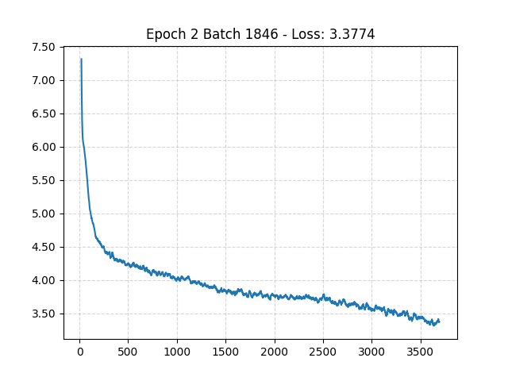
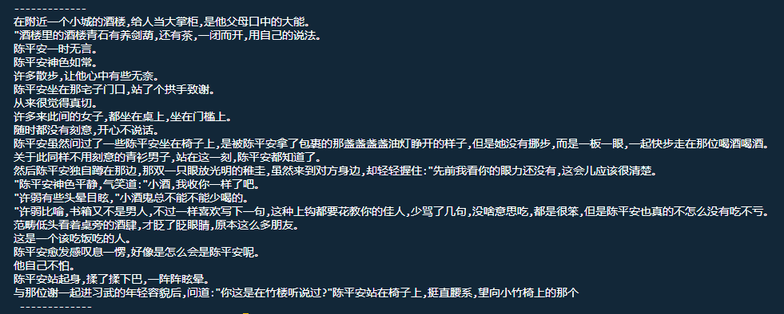

# 模型预训练

> 基于 GPT-2 模型的预训练，使用的数据集是常见网文，.txt格式即可。

## VsCode 项目启动

* 环境依赖

```shell
# python 3.11

# 下载项目
git clone git@github.com:zsh-6534/llm-mini-gpt-2.git

# 进入项目
cd ./llm-mini-gpt-2

# 创建虚拟环境
py -m venv .venv
# 激活虚拟环境 - 这一步很重要哟
.venv\Scripts\activate

# 安装依赖 部分可能需要科学上网
pip install -r requirements.txt

# cuda 环境

# 这东西网络有点差
pip install torch  --index-url https://download.pytorch.org/whl/cu126

# torch 官网
https://pytorch.org/get-started/locally/


# 安装代码风格检查 autopep8
py -m pip install -U autopep8
```

* 训练脚本

```shell
# 确保激活环境
.venv\Scripts\activate

# 数据清洗
py src/dataset/format.py

# 分词器格式化 
py src/token/tokenizer.py

# 数据源，有版权之争
# 自行科学处理数据源（狗头）
mkdir src/dataset/source
mkdir src/dataset/target
```

* 项目启动

```shell
# 确保激活环境
.venv\Scripts\activate

# 启动项目
py main.py

# 模型参数  105.98M
# 自己去改超参数就行了
```

## 模型训练

* batch - loss 曲线



* test


